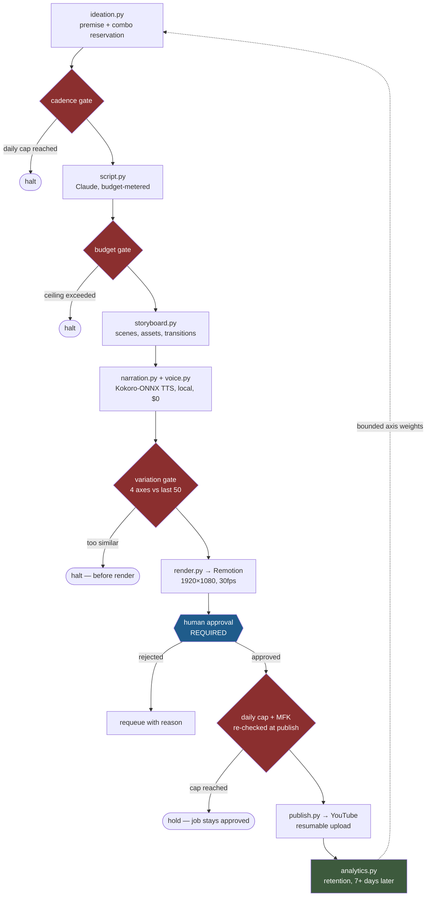
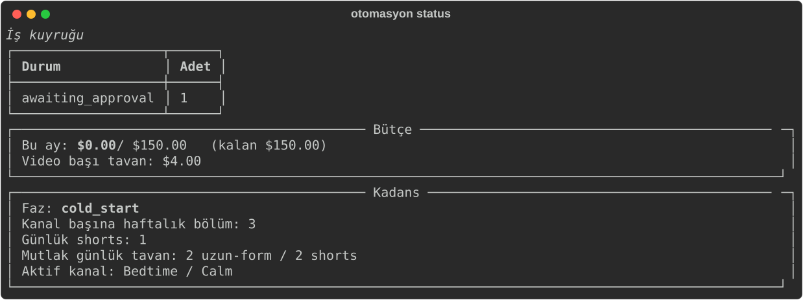
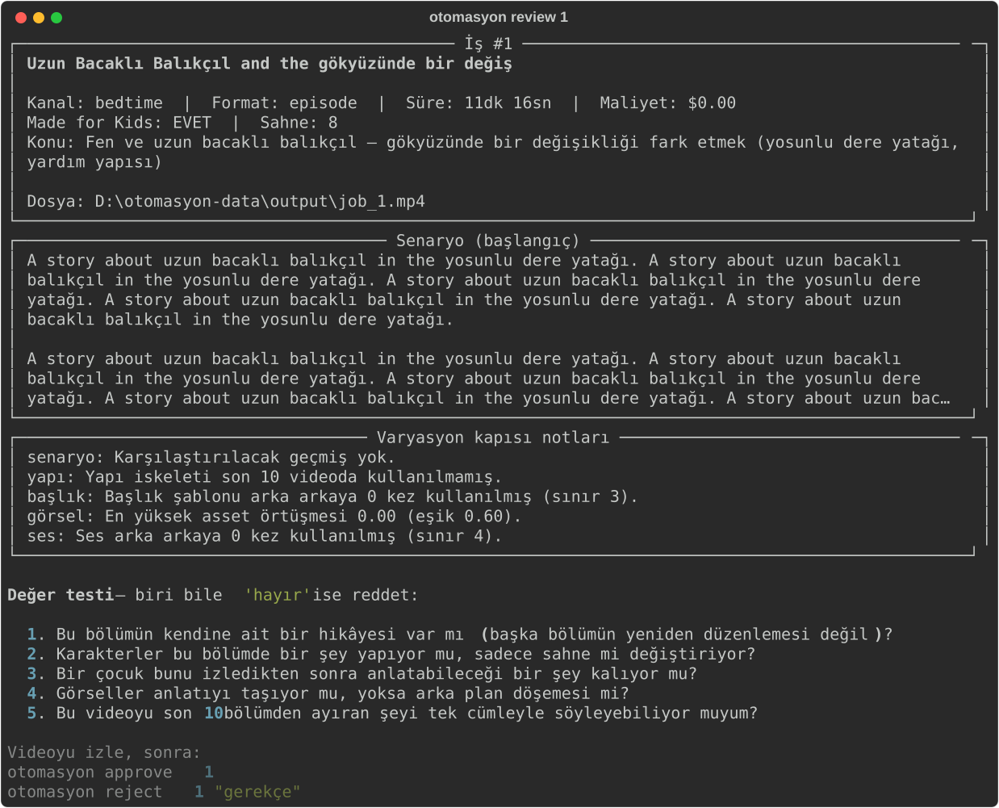

# Gated Video Pipeline

**An end-to-end automated video production pipeline for two children's YouTube channels — that deliberately does not automate the publish decision.**

[](https://github.com/codcreater1/gated-video-pipeline/actions/workflows/ci.yml)
[](https://www.python.org/downloads/)
[](LICENSE)


<sub>A real frame from the pipeline. Characters are drawn in code (React/SVG), not stock assets — see [`remotion/src/characters/`](remotion/src/characters/).</sub>

---

## Why this exists

On 15 July 2025 YouTube renamed its "repetitious content" policy to **"inauthentic content"**. Channels filled with template-stamped, near-identical AI videos started losing monetization on a fixed path: warning → 90-day suspension → permanent removal from the Partner Program. In December 2025 Screen Culture and KH Studio — 2M+ subscribers and 1B+ views between them — were terminated under exactly this rule.

The naive version of this project is a cron job that generates a video and uploads it. That version gets the channel killed, and the failure is not gradual — you find out after the strike.

So this pipeline automates **production** and stops at **publication**. Everything up to the finished MP4 runs unattended; a human decides whether it goes out. The interesting engineering is not the generation, it is the set of gates that refuse to let bad output through.

## Gates that cannot be bypassed

| Gate | Module | What it refuses |
|---|---|---|
| **Cadence** | [`core/pipeline.py`](core/pipeline.py) | More than 2 long-form / 2 shorts in a single day, in any phase. A hard ceiling no growth phase can raise. |
| **Variation** | [`core/variation_guard.py`](core/variation_guard.py) | Scripts, titles, asset combinations or voices that repeat the last 50 videos too closely. |
| **Budget** | [`core/budget.py`](core/budget.py) | Any job that would exceed the per-video or monthly spend ceiling. |
| **Human approval** | [`core/approval.py`](core/approval.py) | Every video, without exception. Nothing publishes unreviewed. |

None of these are configurable off in a way that matters. `REQUIRE_HUMAN_APPROVAL=false` is accepted by the parser and then reported as a problem by [`config.validate()`](core/config.py) and by `otomasyon doctor`.

The variation gate is the one worth reading. It compares each candidate against the previous 50 videos on four independent axes and rejects on any one of them:

| Axis | Threshold |
|---|---|
| Script similarity (TF-IDF cosine) | reject above `0.82` |
| Same title pattern in a row | max `3` |
| Asset combination overlap | reject above `0.60` |
| Same voice in a row | max `4` |

It runs locally — no API call, no per-check cost — and it runs **before** rendering, because rendering a video that is going to be rejected costs ~23 minutes on this hardware.

## Architecture



Two ordering decisions carry weight:

- **Narration runs before the variation gate.** The gate's voice axis needs to know which voice was used, and voice selection happens during narration. More importantly, scene durations are only real once audio exists — the script's estimates are guesses.
- **The variation gate runs before rendering.** See above: a rejection after rendering is 23 wasted minutes.
- **The cadence cap is re-checked at publish, not just at creation.** Approved jobs accumulate in the queue. Checking the daily ceiling only when a job is *created* means five approved videos can still go out on the same day — and "how many were published today" is what the policy actually measures.

That second point was not theoretical. In an end-to-end test the script estimated 66 seconds of narration for a scene; the actual audio came out at 32.5 seconds — a **2× error**. Without [`core/narration.py`](core/narration.py) rewriting scene durations from measured audio length, the video would have carried 33 seconds of silence. Over a 10-minute episode that compounds into minutes of drift.

## Engineering constraints

Every architectural decision here traces back to one reference machine: i5-9300H (4c/8t), 16 GB RAM, GTX 1650 with **4 GB VRAM**, 17 GB free on the system SSD, 1.4 TB on an external exFAT drive.

**No Docker.** WSL is broken on this machine (`REGDB_E_CLASSNOTREG`) and Docker Desktop wants ~10 GB that the system drive does not have. n8n is installed via npm — an officially supported path.

**Kokoro-ONNX, not PyTorch.** 82M parameters, ~300 MB of runtime, comfortable on CPU at roughly 1.0× realtime. PyTorch + CUDA would have wanted ~4 GB of disk, and Chatterbox does not fit in 4 GB of VRAM. Cost per minute of narration: **$0**.

**Long-form is concatenated, never rendered.** 8–12 minute episodes render in Remotion at a measured 13.3 fps; 40–60 minute compilations are stitched from them with `ffmpeg concat` in seconds. Rendering a 60-minute piece in one pass would take ~2.3 hours.

**Code on the internal drive, data on the external one — no exceptions.** This rule was broken exactly once and the cost was measured: installing n8n's dependency tree (232,320 files) onto the exFAT external drive wrote **31 MB in 45 minutes** before being cancelled. The same install on the internal NVMe finished in minutes. Small-file workloads and USB exFAT are incompatible in practice; large render outputs and model weights are exactly what the external drive is for.

Measured numbers live in [docs/benchmarks.md](docs/benchmarks.md).

## Channels

|  | Channel A — Bedtime | Channel B — Story Time |
|---|---|---|
| Audience age | 2–5 | 5–10 |
| Made for Kids | Yes | Yes |
| Length | 8–12 min episodes → 40–60 min compilations | 10–20 min |
| Pacing | Slow, calm (`speech_rate=0.82`) | Normal narration |
| Status | Active | Inactive until phase 4 |

Both channels are marked Made for Kids because both target audiences are under 13, which is the point at which COPPA stops being a preference. Channel B has the better RPM if it is *not* marked MFK, and that is precisely the trade this codebase refuses to make — [`core/config.py`](core/config.py) hard-codes it and `config.validate()` raises if any channel targeting under-13s is left unmarked. See [docs/content-guidelines.md §1](docs/content-guidelines.md).

Channel B stays inactive until Channel A has 30+ videos and real retention data. One channel is faster to learn from and presents a smaller policy surface.

Both produce in **English**; YouTube's auto-dubbing (27 languages) covers ES / PT-BR / HI / ID / AR.

## Quickstart

```bash
git clone https://github.com/codcreater1/gated-video-pipeline.git
```

```bash
uv venv --python 3.12 .venv && .venv\Scripts\activate
```

The core logic — gates, cadence, database, CLI — installs without the heavy runtime dependencies, so the whole gate suite is testable without downloading an ONNX runtime:

```bash
uv pip install -e ".[dev]"
```

For actual production (Kokoro TTS + YouTube client):

```bash
uv pip install -e ".[runtime,dev]"
```

Copy the config and set at minimum `OTOMASYON_DATA_ROOT` and `ANTHROPIC_API_KEY`:

```bash
copy .env.example .env
```

Then verify the environment and initialise storage:

```bash
otomasyon doctor && otomasyon init
```

`otomasyon doctor` checks Python, ffmpeg, Node, the external drive, config consistency and the database, and tells you exactly what is missing. Full setup — including YouTube OAuth and n8n — is in [docs/setup.md](docs/setup.md).

## CLI

| Command | Purpose |
|---|---|
| `otomasyon doctor` | Environment and configuration audit |
| `otomasyon init` | Create data directories and database (idempotent) |
| `otomasyon status` | Queue state, budget spend, active cadence phase |
| `otomasyon queue` | List videos awaiting approval |
| `otomasyon review <id>` | Show the review card and value-test checklist |
| `otomasyon approve <id>` | Approve and move to the upload queue |
| `otomasyon reject <id> "reason"` | Reject — the job is requeued, never deleted |
| `otomasyon authorize <channel>` | YouTube OAuth, once per channel |
| `otomasyon uploads` | Approved videos not yet uploaded |
| `otomasyon publish <id>` | Upload to YouTube — the only irreversible command |
| `otomasyon analytics [--refresh]` | Retention per episode and the axis weights it produces |
| `otomasyon setup-node` | Fetch portable Node 22 for n8n (leaves system PATH alone) |



`review` is where the human gate actually lives. It prints the script excerpt, the cost, the Made-for-Kids flag, the variation gate's per-axis notes, and a checklist where a single "no" means rejection:



<sub>Both captures are real output from a pipeline run — only the LLM, TTS and renderer were stubbed, exactly as the test suite does it.</sub>

## Measured performance

| Stage | Measurement |
|---|---|
| Render (vector characters, concurrency 3) | 13.3 fps → ~23 min for a 10-minute episode |
| Narration (Kokoro-ONNX, CPU) | ~1.0× realtime, $0 |
| End-to-end (33s output) | 114.6 s, **0.58 s A/V drift** |
| Output size | ~4 MB/min |

Full methodology in [docs/benchmarks.md](docs/benchmarks.md).

## Publishing

[`core/publish.py`](core/publish.py) is the pipeline's only irreversible operation, and it is written to behave like it. Everything before it can be undone: a rejected job returns to the queue, a failed render is retried. A video that reaches YouTube becomes part of the channel's policy surface permanently.

So it produces nothing. It moves an already-approved file and re-verifies three things on the way:

- **Approval.** `approval.assert_publishable()` is called — a contract [`core/approval.py`](core/approval.py) states explicitly.
- **The daily cap**, for the reason above.
- **The Made for Kids flag.** `config.validate()` holds this at the configuration level, but the value that reaches the API is built here. The upload body sets `selfDeclaredMadeForKids` — the writable field; `madeForKids` is read-only and sending it would leave the flag silently unset.

The variation fingerprint is committed *after* a successful upload, never at generation time, so unpublished attempts never pollute the comparison window.

Uploads are resumable in 4 MB chunks with exponential backoff on 5xx — a 40 MB episode that drops at 90% resumes instead of restarting. If the upload fails, the job stays `approved` and can be retried.

`snippet.defaultAudioLanguage` is set explicitly: YouTube's auto-dubbing does nothing without it, and leaving it empty would silently cancel the entire 27-language plan.

## The feedback loop, and why it is deliberately weak

[`core/analytics.py`](core/analytics.py) closes the only loop in the system: it reads retention for published episodes and weights `ideation`'s axis selection accordingly. Settings, companions and narrative shapes that held attention get picked more often.

The interesting constraint is that **this feature must not work too well.** "Do more of what performed" is the instinct behind every recommendation-driven content operation, and followed honestly it converges on one setting, one companion, one shape — which is the exact pattern the variation gate rejects and the exact pattern the inauthentic-content policy targets. An unbounded optimizer here does not grow the channel; it terminates it.

So the weighting is clamped in three places:

| Bound | Value | What it prevents |
|---|---|---|
| Minimum samples before a value's weight moves | 3 episodes | One lucky video dominating the pool |
| Weight range | `0.5 – 2.0` | The best value is at most twice as likely as neutral — never exclusive |
| Floor above zero | no value reaches 0 | Feedback can bias the pool, never prune it |

Measurement uses `averageViewPercentage`, not views. Views scale with subscriber count and whatever YouTube's distribution did that day; they say little about whether a given episode held attention. Nothing is measured until an episode is at least 7 days old — the first days are a notification wave, not performance.

A test asserts that with the maximum weight applied, **every** value in the pool is still reachable. That test exists because the failure it guards against is silent: a pipeline that slowly narrows until the variation gate stops it.

## Status

Implemented and tested end to end: ideation with performance feedback, scripting, storyboarding, narration, TTS, rendering, all four gates, the review queue, YouTube publishing, post-publish analytics, the database, and the CLI — **144 tests**, run on every push by CI.

Neither the upload nor the analytics path touches a Google API in tests: the uploader and the metrics fetcher are both injectable, so the tests assert what *would* be sent and what *would* be done with what comes back.

Not yet built: the asset pack. `storyboard.py` derives asset identifiers (`bg/mossy_stream/dusk`, `char/heron/standing`) that the Remotion layer currently renders from code-drawn vectors. When a real asset pack arrives, those identifiers map onto files and no Python changes.

## Project layout

```
.
├─ core/               # Python production logic (16 modules)
│  ├─ pipeline.py      #   orchestrator — applies gates in order
│  ├─ variation_guard.py, budget.py, approval.py   # the gates
│  ├─ ideation.py, script.py, storyboard.py        # content generation
│  ├─ narration.py, voice.py                       # Kokoro TTS
│  ├─ render.py        #   Remotion driver
│  ├─ publish.py       #   YouTube upload — the irreversible step
│  ├─ analytics.py     #   retention → bounded ideation weights
│  └─ config.py, db.py, doctor.py, cli.py
├─ remotion/           # video templates (React + TypeScript)
│  └─ src/characters/  #   Fen and companions, drawn in SVG
├─ tests/              # 144 tests, no external-drive dependency
├─ scripts/n8n.ps1     # n8n launcher
└─ docs/
```

Heavy data (assets, models, render output, cache, database) lives outside the repo under `OTOMASYON_DATA_ROOT`. When the external drive is unplugged, `otomasyon doctor` reports one clear error and skips the data checks — n8n and the test suite keep working.

## Documentation

- [docs/setup.md](docs/setup.md) — installation, from Node to YouTube OAuth
- [docs/content-guidelines.md](docs/content-guidelines.md) — COPPA/MFK classification, banned topics, the per-episode value test
- [docs/benchmarks.md](docs/benchmarks.md) — measured render, TTS and end-to-end numbers

## License

MIT — see [LICENSE](LICENSE).

> Note: source comments and CLI output are in Turkish. Documentation is in English.
